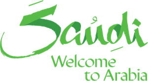

# Tourism in Kingdom of Saudi Arabia

 - Overview 

One of Saudi Arabia **2030** vision key initiatives is **“Quality of life”**. This initiative comes with the aim of diversifying and enriching the tourism and entertainment experience in the Kingdom. 
It improve the quality of life by developing the necessary environment to create more vibrant options that enhance the participation and experience of citizens, residents and visitors.

The Saudi Tourism Authority has launched tourism programs such as **(Saudi Spirit)**, a deliberative platform which you can discover tourist destinations, events and seasons. Through the platform, visitors can find suitable packages and trips, and entertainment activities available such as AlUla Winter, Riyadh , Jeddah and Alahsa Seasons.

- Problem Statment 

In this time of the year, hotels and resort are in high demand in the Kingdom. We will predict the prices in the current month (December 2021)

- Data Description 

We webscraping the (booking) website and comind it with data from kggle. 

- Features 

Hotel_Name : Hotels Names in saudi 

Price : Price of this room in this period of time

Rating: Hotel rating

rating_title: Is it Excellent ,good ,very good etc….

Number_of_Ratings : people visit this hotel reviews

Room_type : Type of room

location: Hotel location 

- Tools 

Pandas , Selenium , Beautiful Soup , Sklearn. 
